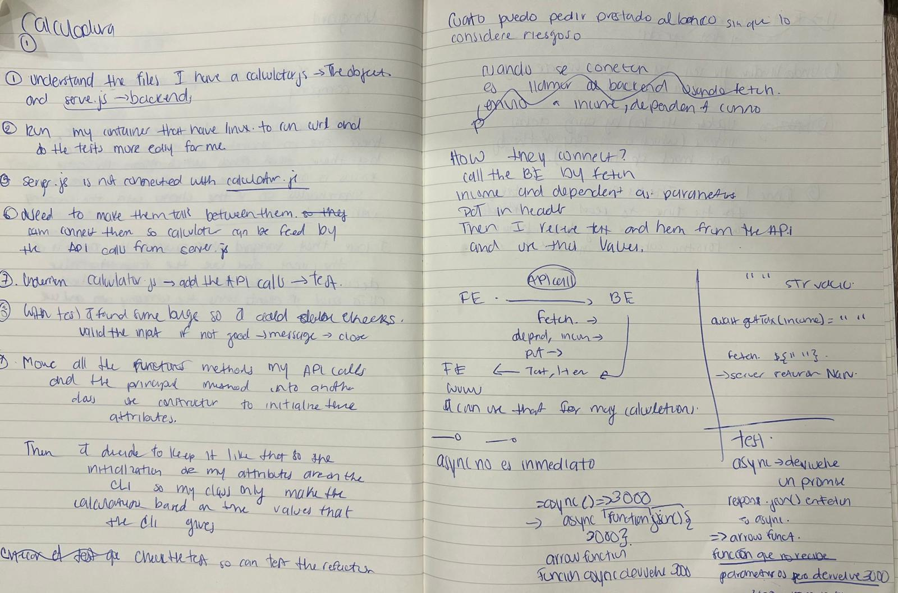

# Borrowing Power Calculator

Hello and thanks so much for taking the time to do the Ferocia Junior Engineering Code Exercise.

This borrowing power calculator written in Javascript was started by one of our juniors, Gen (her full name is “Gen A. Eye”), but she she went on leave before she could finish it…

We need you to progress the code in her absence. Once you’ve submitted your work and we’ve reviewed it, you’ll sit down and explain the code to Gens team members (our interviewers) in a pairing session.

Keep in mind that we’ll expect you to be able to explain and expand on the code you submit.

If you haven’t done much Javascript before don’t worry. We’ll take your experience into account, just give it your best shot.

You can see our online borrowing power calculator (Gens project is simplified so dont expect the number to match perfectly) to see how it work (https://www.bendigobank.com.au/personal/loans/calculators/borrowing-power/).

## Please try to complete the following:

### Replace the two placeholder functions

The code needs to calculate tax on income and a HEM (Household Expense Measure) value.
Currently this is performed by placeholder code in the following functions:
getTax(income)
getHEM(income, dependents)
You will need to replace the code in both with API calls.
We have provided a server.js which can you run locally to expose the following 2 development endpoints:
http://localhost:3000/api/tax?income=[income]
http://localhost:3000/api/hem?income=[income]&dependents=[dependents]
Both return JSON and require an authentication header with a valid PAT (Personal Access Token), see server.md for full documentation including the development PAT.

### Make it manageable

Gen planned to pull all the calculator functions into a class so she could extend it later, but we’ll leave it up to you to choose the approach (a well-formed class, an orchestrator function, a factory/closure pattern, or whatever)

### Test coverage

Of course we’ll need the test suite to pass and have full coverage.

## Rules:

Use whatever tools and resources help you get the job done. That includes AI, documentation, Stack Overflow, or anything else. What matters is that you understand every line you submit. In the follow-up pairing session, we'll ask you to walk us through your code, explain your decisions, and make changes on the fly - without an AI in Agent mode. If you can't do that confidently, it will count against you. The goal isn't to catch you out, it's to understand how you think.

## Setup

Make sure you have Node.js installed.

Install dependencies:

```
npm install
```

## Server

You wil need to run the development API in it's own terminal window.
(The server will be available at http://localhost:3000/).
To start the server run the following command:

```
npm run api
```

Note: You can stop the server with Ctrl+C

## Running

Run the calculator with:

```
npm start
```

## Testing

Run tests with:

```
npm test
```

## How My Brain Works

Here's a walkthrough of my thought process while working through this challenge, step by step.

**1. Understand the problem first**
Before writing any code, I read through `README.md` and `server.md` to understand what already existed, what was missing, and what the API endpoints expected (URL params, headers, response shape).

**2. Set up a comfortable environment for testing the API**
I ran an Ubuntu container attached to VS Code so I could use `curl` to test the API endpoints directly before touching any JavaScript. This let me confirm what `server.js` actually returned (and what headers it required) without guessing.

**3. Identify the disconnect**
`server.js` and `borrowingCalculator.js` weren't talking to each other. `getTax` and `getHEM` were still placeholder functions with hardcoded logic. My first real task was to connect them: replace the placeholders with real `fetch` calls to the endpoints, so the calculator would be powered by live data instead of guesses.

**4. Add the API calls, then handle what broke**
After wiring up the `fetch` calls, I tested the CLI end-to-end and found that leaving inputs blank sent invalid values (`NaN`) straight to the API, causing 400 errors. I added input validation at each `rl.question` step, so if the input isn't a valid number, the user sees a clear error message and the CLI closes instead of crashing or silently producing wrong numbers.

**5. Make it manageable: refactor into a class**
I moved `getTax`, `getHEM`, and `calculateBorrowingPower` into a `CalculatorFunctions` class. I deliberately designed the constructor to receive configuration (token, loan term, interest rate, assessment buffer) as parameters rather than hardcoding them inside the class. The CLI decides _what_ values to use, and the class only knows _how_ to use them.

**6. Update the tests to match the new structure**
Once the logic lived inside a class, I refactored `test_calculator.js` to create an instance of `CalculatorFunctions` per test and mock out `getTax`/`getHEM` with fixed return values. This way the tests don't depend on the real API server running, and always produce predictable, repeatable results. I also added two more tests to make sure the API calls throw an error correctly when they fail.

**7. Sketching it out on paper**
I really like to sketch things out on paper, it really helps me to structure my ideas and see the flow of the problem. Here's a photo of my notes from this exercise. It's not perfect and quite messy, with a mix of Spanish and English, but it really helped me:

<p align="center">
  
</p>

**8. Done!**
Thanks so much for taking the time to read through how I think and for the exercise itself!
